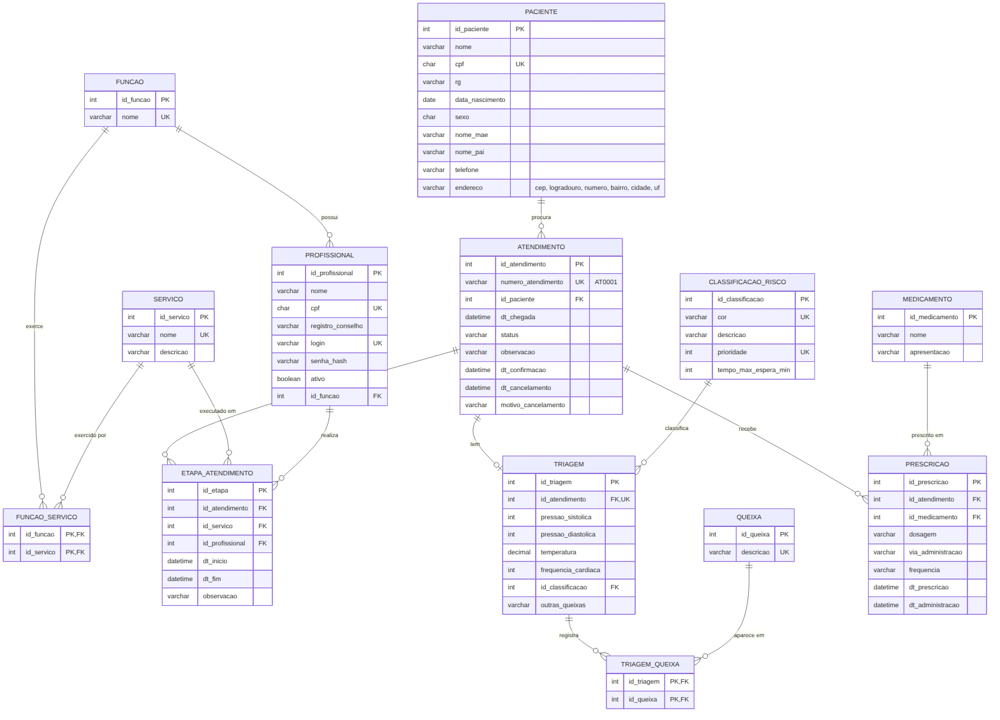

# Banco de Dados

MySQL 8. Modelo baseado no MER visto em aula, com as tabelas de triagem, classificação de Manchester e medicações.

## Execução

1. `01_criacao_tabelas.sql`: cria o banco `pronto_socorro`, as tabelas e a view do painel.
2. `02_dados_iniciais.sql`: insere os dados iniciais e alguns atendimentos de teste.

## Status do atendimento

`AGUARDANDO_TRIAGEM` → `AGUARDANDO_MEDICO` → `EM_ATENDIMENTO` → `FINALIZADO` (ou `CANCELADO` antes da finalização)
